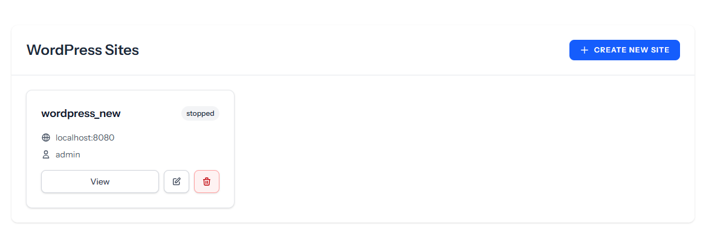
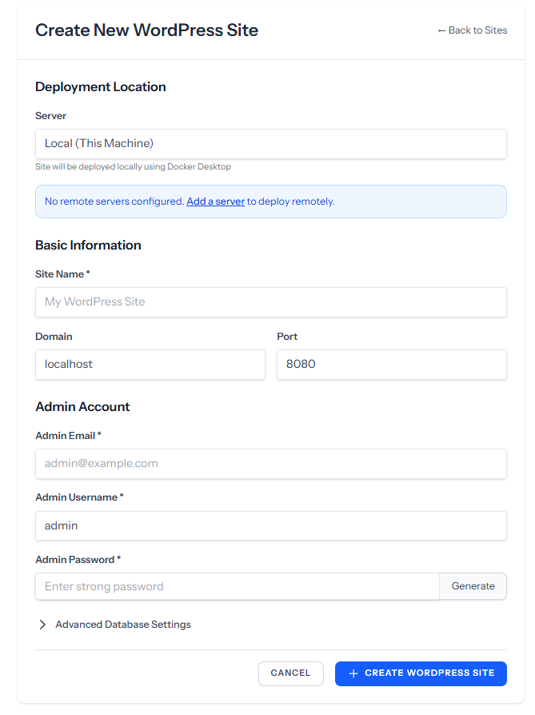
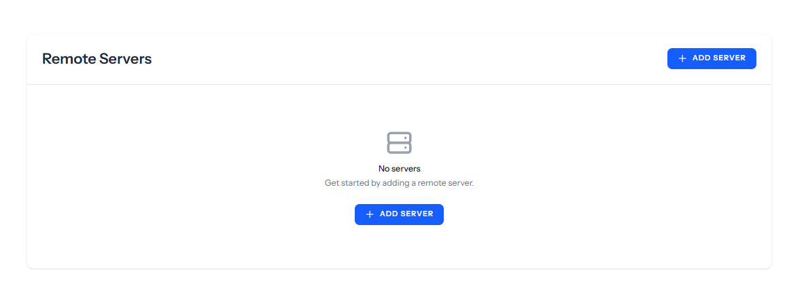

# Simple WordPress Site Manager

A Laravel-based web application for managing WordPress sites on local and remote VPS servers using Docker containers. Deploy, configure, and monitor multiple WordPress installations from a single dashboard with no technical expertise required.


## ✨ Features

### Core Functionality
- 🚀 **One-Click WordPress Deployment** - Deploy WordPress sites locally or on remote VPS servers
- 🔐 **Encrypted Credentials** - All sensitive data (passwords, SSH keys) encrypted at rest
- 🐳 **Docker-Based** - Each site runs in isolated Docker containers
- 🌐 **Multi-Server Support** - Manage WordPress sites across multiple servers
- 📊 **Real-Time Monitoring** - Automated container status tracking every 5 minutes
- 🔄 **CRUD Operations** - Full create, read, update, delete support for sites and servers

### Server Management
- SSH connection via password or SSH key
- Connection testing before deployment
- Automated monitor script installation
- Support for multiple remote servers
- Local Docker Desktop integration

### WordPress Site Features
- Automatic MySQL database setup
- Custom domain and port configuration
- Start/Stop containers without data loss
- View container logs in real-time
- One-click access to WordPress admin

## 📋 Requirements

### Local Development (Windows)
- Windows 10/11 with WSL2
- Docker Desktop for Windows


### Remote VPS Server
- Ubuntu 20.04+ (or any Linux distribution)
- Docker and Docker Compose installed
- SSH access with sudo privileges
- Ports 8080-9000 available
- Minimum 2GB RAM recommended

## 🚀 Quick Start

### 1. Clone Repository

```bash
git clone https://github.com/alaminfullstack/simple-wp-site-manager.git
cd simple-wp-site-manager
```

### 2. Install Dependencies

```bash
# PHP dependencies
composer install

# JavaScript dependencies
npm install


### 3. Environment Setup

```bash
# Copy environment file
copy .env.example .env

# Generate application key
php artisan key:generate

# Configure database in .env
DB_CONNECTION=mysql
DB_HOST=127.0.0.1
DB_PORT=3306
DB_DATABASE=wordpress_manager
DB_USERNAME=root
DB_PASSWORD=
```

### 4. Database Migration

```bash
php artisan migrate
```

### 5. Build Frontend Assets

```bash
# Development
npm run dev

# Production
npm run build
```

### 6. Start Application

```bash
# Using Laragon
# Just start Laragon and access via http://your-project.test

# Or using Artisan
php artisan serve
# Access via http://localhost:8000
```

## 📖 Usage Guide

### Managing Servers

#### Add a Remote Server
1. Navigate to **Servers** → **Add Server**
2. Enter server details:
   - Name (e.g., "Production Server 1")
   - IP Address
   - SSH Port (default: 22)
   - SSH Username
   - Authentication method (Password or SSH Key)
3. Click **Add Server** (connection will be tested automatically)

#### Install Monitor Script
1. Go to server details page
2. Click **Install Monitor Script**
3. Script will be installed and configured automatically
4. Container statuses will update every 5 minutes

### Creating WordPress Sites

#### Local Deployment
1. Go to **WordPress Sites** → **Create New Site**
2. Leave "Server" as "Local (This Machine)"
3. Fill in site details:
   - Site Name
   - Port (default: 8080)
   - Admin Email
   - Admin Username and Password
4. Click **Create WordPress Site**
5. Wait 1-2 minutes for deployment
6. Access your site at `http://localhost:8080`

#### Remote Deployment
1. Go to **WordPress Sites** → **Create New Site**
2. Select your remote server from dropdown
3. Fill in site details
4. Click **Create WordPress Site**
5. Site will be deployed to remote server
6. Access via `http://server-ip:port`

### Managing Sites

- **Start/Stop** - Control containers without losing data
- **Edit** - Update site configuration
- **View Logs** - Check container logs for debugging
- **Delete** - Remove site and all data

## 🏗️ Architecture

### Technology Stack
- **Backend**: Laravel 11.x
- **Frontend**: React 18.x + Inertia.js
- **Styling**: Tailwind CSS
- **Containerization**: Docker + Docker Compose
- **Remote Access**: SSH via phpseclib3
- **Database**: MySQL 8.0 (for both app and WordPress sites)

### Project Structure

```
simple-wp-site-manager/
├── app/
│   ├── Http/
│   │   └── Controllers/
│   │       ├── Api/
│   │       │   └── StatusApiController.php
│   │       ├── ServerController.php
│   │       └── WordPressController.php
│   ├── Models/
│   │   ├── Server.php
│   │   └── WordPressSite.php
│   └── Services/
│       ├── SSHService.php
│       └── DockerService.php
├── database/
│   └── migrations/
├── resources/
│   └── js/
│       └── Pages/
│           ├── Servers/
│           └── WordPress/
├── routes/
│   ├── web.php
│   └── api.php
├── scripts/
│   └── docker-monitor.sh
└── storage/
    └── wordpress-sites/
```

## 🔒 Security

### Data Encryption
All sensitive data is encrypted using Laravel's encryption:
- Server SSH passwords
- Server SSH private keys
- WordPress database passwords
- WordPress admin passwords

### SSH Connection
- Supports both password and key-based authentication
- Connection testing before accepting server
- Encrypted credential storage
- Secure SFTP file transfers

### API Security
- CSRF protection on all forms
- Rate limiting on API endpoints
- Authentication required for all operations
- Input validation and sanitization

## 🔧 Configuration

### Environment Variables

```env
# Application
APP_NAME="WordPress Site Manager"
APP_URL=https://your-domain.com

# Docker Configuration
DOCKER_SITES_PATH=/var/www/wordpress-sites
WORDPRESS_BASE_PORT=8080
WORDPRESS_MAX_PORT=9000

# SSH Configuration
DEFAULT_SSH_PORT=22
SSH_CONNECTION_TIMEOUT=30
```

### Monitor Script Configuration

Edit `/usr/local/bin/docker-monitor.sh` on remote server:

```bash
API_URL="https://your-domain.com/api/sites/update-status"
API_TOKEN="your-secure-token"
LOG_FILE="/var/log/docker-monitor.log"
```

## 🐛 Troubleshooting

### Docker Not Running
**Problem**: "Docker is not running" error

**Solution**:
```bash
# On Windows
# Ensure Docker Desktop is running

# Check Docker status
docker ps

# Restart Docker Desktop if needed
```

### SSH Connection Failed
**Problem**: Cannot connect to remote server

**Solution**:
1. Verify server IP and SSH port
2. Check firewall allows SSH connection
3. Test manually: `ssh user@ip -p port`
4. Ensure user has sudo privileges
5. Check server status in dashboard

### Port Already in Use
**Problem**: Port conflict when creating site

**Solution**:
- System auto-increments ports (8080 → 8081 → 8082...)
- Manually specify different port when creating site
- Check what's using port: `netstat -ano | findstr :8080`

### Monitor Script Not Updating
**Problem**: Status not updating automatically

**Solution**:
```bash
# On remote server
# Check if cron is running
sudo service cron status

# Check monitor logs
tail -f /var/log/docker-monitor.log

# Manually run script
/usr/local/bin/docker-monitor.sh

# Verify cron job exists
crontab -l
```

## 📦 Deployment to Production

### 1. Server Preparation

```bash
# Update system
sudo apt update && sudo apt upgrade -y

# Install Docker
curl -fsSL https://get.docker.com -o get-docker.sh
sudo sh get-docker.sh

# Install Docker Compose
sudo apt install docker-compose -y

# Add user to docker group
sudo usermod -aG docker $USER
```

### 2. Laravel Application Setup

```bash
# Optimize application
php artisan config:cache
php artisan route:cache
php artisan view:cache
composer dump-autoload --optimize

# Build assets
npm run build

# Set permissions
chmod -R 775 storage bootstrap/cache
chown -R www-data:www-data storage bootstrap/cache
```

### 3. Web Server Configuration

Use Nginx or Apache to serve the Laravel application. Example Nginx config:

```nginx
server {
    listen 80;
    server_name your-domain.com;
    root /path/to/simple-wp-site-manager/public;

    add_header X-Frame-Options "SAMEORIGIN";
    add_header X-Content-Type-Options "nosniff";

    index index.php;

    location / {
        try_files $uri $uri/ /index.php?$query_string;
    }

    location ~ \.php$ {
        fastcgi_pass unix:/var/run/php/php8.1-fpm.sock;
        fastcgi_param SCRIPT_FILENAME $realpath_root$fastcgi_script_name;
        include fastcgi_params;
    }

    location ~ /\.(?!well-known).* {
        deny all;
    }
}
```

## 🤝 Contributing

Contributions are welcome! Please feel free to submit a Pull Request.

1. Fork the repository
2. Create your feature branch (`git checkout -b feature/AmazingFeature`)
3. Commit your changes (`git commit -m 'Add some AmazingFeature'`)
4. Push to the branch (`git push origin feature/AmazingFeature`)
5. Open a Pull Request

## 📝 License

This project is licensed under the MIT License - see the LICENSE file for details.

## 👨‍💻 Author

Your Name - [@alaminfullstack]

Project Link: [https://github.com/alaminfullstack/simple-wp-site-manager](https://github.com/alaminfullstack/simple-wp-site-manager)

## 🙏 Acknowledgments

- [Laravel](https://laravel.com) - The PHP Framework
- [Inertia.js](https://inertiajs.com) - Modern monolithic apps
- [React](https://reactjs.org) - JavaScript library
- [Tailwind CSS](https://tailwindcss.com) - Utility-first CSS
- [Docker](https://www.docker.com) - Containerization platform
- [phpseclib](https://phpseclib.com) - Pure PHP SSH implementation

## 📸 Screenshots

### Dashboard


### Server Management


### WordPress Site Creation


### Site Details


---

**Note**: This is a project created for educational and portfolio purposes. Always follow security best practices when deploying to production environments.