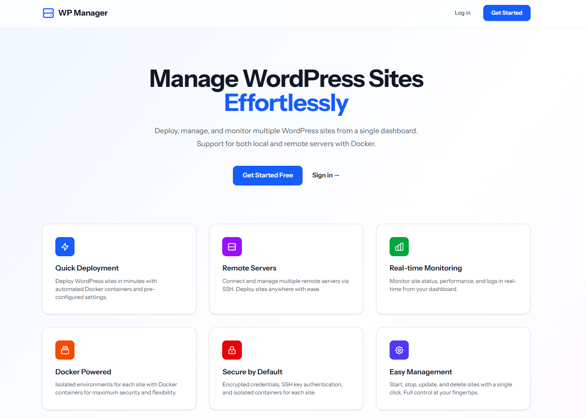
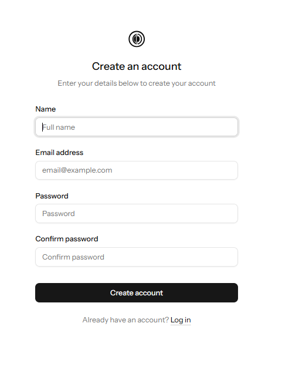
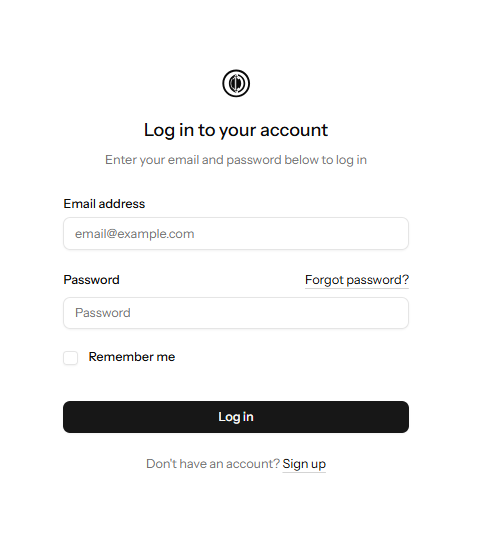
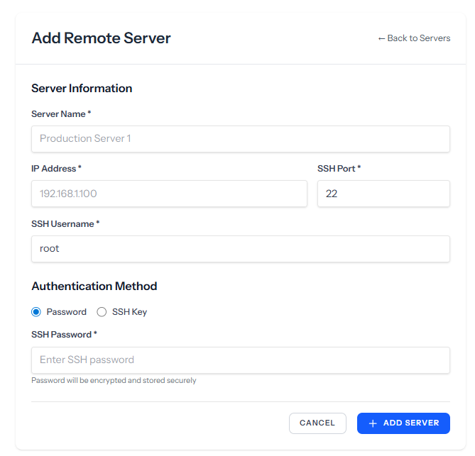
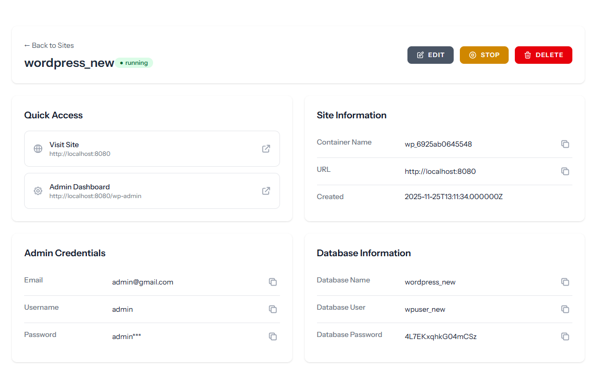

# Simple WordPress Site Manager

A Laravel-based web application for managing WordPress sites on local and remote VPS servers using Docker containers. Deploy, configure, and monitor multiple WordPress installations from a single dashboard with no technical expertise required.


## ✨ Features

### Core Functionality
- 🚀 **One-Click WordPress Deployment** - Deploy WordPress sites locally or on remote VPS servers
- 🔐 **Encrypted Credentials** - All sensitive data (passwords, SSH keys) encrypted at rest
- 🐳 **Docker-Based** - Each site runs in isolated Docker containers
- 🌐 **Multi-Server Support** - Manage WordPress sites across multiple servers
- 📊 **Real-Time Monitoring** - Automated container status tracking every 5 minutes
- 🔄 **CRUD Operations** - Full create, read, update, delete support for sites and servers

### Server Management
- SSH connection via password or SSH key
- Connection testing before deployment
- Automated monitor script installation
- Support for multiple remote servers
- Local Docker Desktop integration

### WordPress Site Features
- Automatic MySQL database setup
- Custom domain and port configuration
- Start/Stop containers without data loss
- View container logs in real-time
- One-click access to WordPress admin

## Prerequisites

Before you begin, ensure you have the following installed:

- [Docker Desktop](https://www.docker.com/products/docker-desktop/) (for Windows/Mac) or Docker Engine (for Linux)
- [Git](https://git-scm.com/downloads)
- A code editor of your choice (VS Code recommended)

## Initial Setup

### 1. Clone the Repository

```bash
git clone https://github.com/alaminfullstack/simple-wp-site-manager.git
cd simple-wp-site-manager
```

### 2. Configure Environment Variables

Copy the example environment file to create your own configuration:

```bash
cp .env.example .env
```

You can now edit the `.env` file with your preferred settings. The default configuration is already set up for Docker:

```env
DB_CONNECTION=mysql
DB_HOST=mysql
DB_PORT=3306
DB_DATABASE=laravel
DB_USERNAME=laravel
DB_PASSWORD=password

REDIS_HOST=redis
REDIS_PASSWORD=null
REDIS_PORT=6379

QUEUE_CONNECTION=redis
```

### 3. Build and Start the Application

Run the following command to build and start all Docker services in the background:

```bash
docker-compose up -d --build
```

This command will build and start the following services:
- `app`: PHP-FPM server running Laravel
- `nginx`: Web server
- `mysql`: Database server
- `redis`: Cache and queue server
- `queue`: Laravel queue worker
- `node`: Node.js for frontend assets

### 4. Install Dependencies

Install the PHP and Node.js dependencies inside their respective containers.

```bash
# Install PHP dependencies
docker-compose exec app composer install

# Install Node.js dependencies
docker-compose exec node npm install

# Build frontend assets for production
docker-compose exec node npm run build
```

### 5. Finalize Laravel Setup

Run these essential Artisan commands to prepare the application.

```bash
# Generate a unique application key
docker-compose exec app php artisan key:generate

# Run database migrations
docker-compose exec app php artisan migrate

# Create the symbolic link for public storage
docker-compose exec app php artisan storage:link
```

## Accessing the Application

Once all steps are complete, you can access the application in your browser at:

**Frontend:** `http://localhost:8080`

## Common Development Commands


### Queue Management

The queue worker starts automatically with `docker-compose up`. You can manage it with these commands:

```bash
# View queue worker logs in real-time
docker-compose logs -f queue

# Restart the queue worker
docker-compose restart queue

# Run a one-time queue command (useful for testing)
docker-compose exec app php artisan queue:work --once

# View and retry failed jobs
docker-compose exec app php artisan queue:failed
docker-compose exec app php artisan queue:retry all
```

### Database Operations

```bash
# Run migrations
docker-compose exec app php artisan migrate

# Seed the database
docker-compose exec app php artisan db:seed

# Access MySQL command line (password is 'password')
docker-compose exec mysql mysql -u laravel -p
```

## Troubleshooting

### Permission Issues

If you encounter permission errors with `storage` or `bootstrap/cache`:

```bash
# Fix permissions from within the app container
docker-compose exec app chown -R www-data:www-data storage bootstrap/cache
docker-compose exec app chmod -R 775 storage bootstrap/cache
```

### Port Conflicts

If port `8080` is already in use on your machine, you can change it in the `docker-compose.yml` file:

```yaml
# find the nginx service and change the port mapping
nginx:
  ports:
    - "8081:80"  # Change to your preferred port
```

After changing the port, run `docker-compose up -d --build nginx` to apply the change.

### Container Not Starting

If a container fails to start:

1.  Check the logs for errors:
    ```bash
    docker-compose logs <service_name>
    ```
2.  Try rebuilding the specific container:
    ```bash
    docker-compose up -d --build <service_name>
    ```
3.  If all else fails, remove all containers and start fresh (this will not delete your database data):
    ```bash
    docker-compose down
    docker-compose up -d --build
    ```

### Docker Not Running
**Problem**: "Docker is not running" error

**Solution**:
```bash
# On Windows
# Ensure Docker Desktop is running

# Check Docker status
docker ps

# Restart Docker Desktop if needed
```

### SSH Connection Failed
**Problem**: Cannot connect to remote server

**Solution**:
1. Verify server IP and SSH port
2. Check firewall allows SSH connection
3. Test manually: `ssh user@ip -p port`
4. Ensure user has sudo privileges
5. Check server status in dashboard

## Need Help?

If you encounter any issues not covered in this guide, please:
1.  Check the [Laravel documentation](https://laravel.com/docs).
2.  Check the [Docker documentation](https://docs.docker.com/).
3.  Create an issue in the [GitHub repository](https://github.com/alaminfullstack/simple-wp-site-manager/issues).


## 📖 Usage Guide

### Demo Video

<video src="/public/screenshots/demo.mp4" width="600" controls  autoplay muted loop></video>

### Managing Servers

#### Add a Remote Server
1. Navigate to **Servers** → **Add Server**
2. Enter server details:
   - Name (e.g., "Production Server 1")
   - IP Address
   - SSH Port (default: 22)
   - SSH Username
   - Authentication method (Password or SSH Key)
3. Click **Add Server** (connection will be tested automatically)

#### Install Monitor Script
1. Go to server details page
2. Click **Install Monitor Script**
3. Script will be installed and configured automatically
4. Container statuses will update every 5 minutes

### Creating WordPress Sites

#### Local Deployment
1. Go to **WordPress Sites** → **Create New Site**
2. Leave "Server" as "Local (This Machine)"
3. Fill in site details:
   - Site Name
   - Port (default: 8080)
   - advanced database info (optional)
4. Click **Create WordPress Site**
5. Wait 1-2 minutes for deployment
6. Access your site at `http://localhost:8080`

#### Remote Deployment
1. Go to **WordPress Sites** → **Create New Site**
2. Select your remote server from dropdown
3. Fill in site details
4. Click **Create WordPress Site**
5. Site will be deployed to remote server
6. Access via `http://server-ip:port`

### Managing Sites

- **Start/Stop** - Control containers without losing data
- **Edit** - Update site configuration
- **View Logs** - Check container logs for debugging
- **Delete** - Remove site and all data

## 🏗️ Architecture

### Technology Stack
- **Backend**: Laravel 11.x
- **Frontend**: React 18.x + Inertia.js
- **Styling**: Tailwind CSS
- **Containerization**: Docker + Docker Compose
- **Remote Access**: SSH via phpseclib3
- **Database**: MySQL 8.0 (for both app and WordPress sites)


## 🔒 Security

### Data Encryption
All sensitive data is encrypted using Laravel's encryption:
- Server SSH passwords
- Server SSH private keys
- WordPress database passwords
- WordPress admin passwords

### SSH Connection
- Supports both password and key-based authentication
- Connection testing before accepting server
- Encrypted credential storage
- Secure SFTP file transfers

### API Security
- CSRF protection on all forms
- Rate limiting on API endpoints
- Authentication required for all operations
- Input validation and sanitization


### Monitor Script Configuration

Edit `/usr/local/bin/docker-monitor.sh` on remote server:

```bash
API_URL="https://your-domain.com/api/sites/update-status"
API_TOKEN="your-secure-token"
LOG_FILE="/var/log/docker-monitor.log"
```

## 📝 License

This project is licensed under the MIT License - see the LICENSE file for details.

## 👨‍💻 Author

[@alaminfullstack]

Project Link: [https://github.com/alaminfullstack/simple-wp-site-manager](https://github.com/alaminfullstack/simple-wp-site-manager)

## 🙏 Acknowledgments

- [Laravel](https://laravel.com) - The PHP Framework
- [Inertia.js](https://inertiajs.com) - Modern monolithic apps
- [React](https://reactjs.org) - JavaScript library
- [Tailwind CSS](https://tailwindcss.com) - Utility-first CSS
- [Docker](https://www.docker.com) - Containerization platform
- [phpseclib](https://phpseclib.com) - Pure PHP SSH implementation

## 📸 Screenshots

### Welcome


### Login & Register



### Dashboard


### Server Management



### WordPress Site Creation


### Site Details


